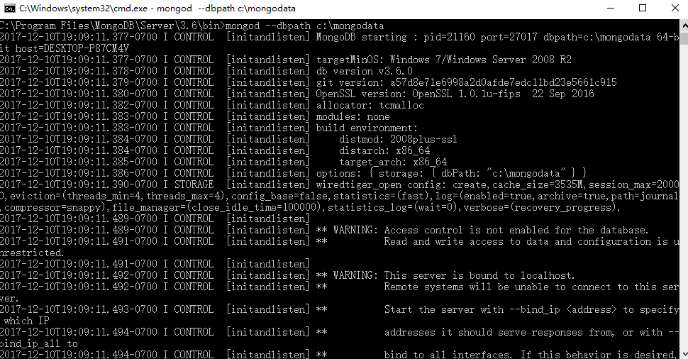

# mongoDB的安装
## windows
下载地址 https://www.mongodb.com/download-center#community     
运行exe安装后，新建数据库存放数据的文件夹（例如在c盘新建mongodata文件夹）     
然后找到mongodb的安装路径运行mongod --dbpath c:\mongodata     
 
## centos7
传送门 https://segmentfault.com/a/1190000008647182      

# API doc
## 用户登陆         
    接口地址：/api/login   
    请求方式：post  
    请求参数说明：
key | des | require 
--- | --- |---    
name | 用户名 | y 
password | 密码 | y
```json
//JSON返回示例：
//成功
{
    "code": 0,
    "msg": "login!"
}
//失败
{
    "code": 1,
    "msg": "wrong password"
}
```
## 用户注册
    接口地址：/api/register  
    请求方式：post  
    请求参数说明：
key | des | require 
--- | --- |---    
name | 用户名 | y 
password | 密码 | y 
email | 电邮 | y
mobile | 手机 | y
gender | 性别 | y
```json
//JSON返回示例：
//成功
{
    "code": 0,
    "msg": "User created!"
}
```
## 获取当前用户信息
    接口地址：/api/info  
    请求方式：get
## 更新当前用户信息
    接口地址：/api/info  
    请求方式：put
## 上传当前用户头像
    接口地址：/api/avatar             
    请求方式：post               
    请求参数说明：                       
key | des | require
--- | --- |---
files | 文件 | y                

## 当前用户新建文件夹
    接口地址：/api/folder   
    请求方式：post  
    请求参数说明：
key | des | require 
--- | --- |---    
type | 文件夹类型 | y
foldername | 文件夹名 | y
createdate | 创建日期 | y   
```json
//JSON返回示例：
//成功
{
    "code": 0,
    "msg": "folder created!"
}
//未登录
{
    "code": 1,
    "msg": "not login"
}
```
## 获取当前用户的文件夹列表
    接口地址：/api/folder   
    请求方式：get
```json
//JSON返回示例：
//成功
{
    "code": 0,
    "data": [
        {
            "_id": "59467d2335058a260a1c4bf6",
            "type": "diary",
            "foldername": "测试日记",
            "username": "ssshooter",
            "__v": 0
        },
        {
            "_id": "59467d3935058a260a1c4bf7",
            "type": "phonebook",
            "foldername": "测试通讯录",
            "username": "ssshooter",
            "__v": 0
        }
    ]
}
```
## 更新指定文件夹名字
    接口地址：/api/folder/:id 
    请求方式：put
    请求参数说明：
key | des | require 
--- | --- |---    
foldername | 文件夹名 | y
## 删除指定文件夹
    接口地址：/api/folder/:id   
    请求方式：delete
```json
//成功
{
    "code": 0,
    "msg": "Successfully deleted"
}
```
## 获取文件夹内所有内容
    请求地址：/api/folder/:type/:folderId
    请求方式：get  
    备注：type限选'diary','phonebook','todolist'
```json
//请求地址：/api/folder/phonebook/59468117f32a07263e259688
//成功
{
    "code": 0,
    "data": [
        {
            "_id": "5946854d715f1326b2075f7d",
            "folderId": "59468117f32a07263e259688",
            "contact": "zhoudejie",
            "number": "15918694038",
            "__v": 0
        }
    ]
}
```
## 新增一篇日记
    接口地址：/api/diary
    请求方法：post
key | des | require | type
--- | --- |--- |---
folderId | 所在folder的id | y | String
title | 日记标题 | y | String
content | 日记内容 | y | String
pic | 图片（地址） | n | Array
mood | 心情 | y | String
weather | 天气 | y | String
bookmark | 书签 | n | boolean
tag | 标签 | n | String
createdate | 创建日期 | y | String(YYYY-MM-DD)
```json
{
    "code": 0,
    "msg": "item created!"
}
```
## 修改一篇日记内容
    请求地址：/api/diary/:id
    请求方式：put  
key | des | require | type
--- | --- |--- |---
title | 日记标题 | y | String
content | 日记内容 | y | String
## 删除一篇日记
    接口地址：/api/diary/:id   
    请求方式：delete
## 新增一条通讯录
    接口地址：/api/phonebook
    请求方式：post  
key | des | require
--- | --- |---
folderId | 所在folder的id | y
contact | 联系人名称 | y
initial | 首字母 | y
number | 电话号码 | y
createdate | 创建日期 | y   
## 修改一条通讯录
    接口地址：/api/phonebook/:id
    请求方式：put  
## 删除一条通讯录
    接口地址：/api/phonebook/:id
    请求方式：delete
## 新增一条待办事项
    接口地址：/api/todolist
    请求方式：post
key | des | require
--- | --- |---
folderId | 所在folder的id | y
state | 事项状态（未完成0 完成1） | y
content | 事项内容 | y
createdate | 创建日期 | y  
## 修改一条待办事项
    接口地址：/api/todolist/:id
    请求方式：put  
## 删除一条待办事项
    接口地址：/api/todolist/:id
    请求方式：delete  

